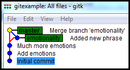

# <a name="Home"></a> Version Control System : Git

## Table of Content:
- [Вступление](#intro)
- [Репозиторий](#repository)
- [Конфигурирование (git config)](#config)
- [Отслеживание изменений](#tracking)
- [Сохранение изменений (commit)](#commit)
- [Ссылки на коммиты (references)](#references)
- [Объединение изменений (слияние)](#merge)
- [Перемещение изменений (перебазирование)](#rebase)
- [Отправка изменений (синхронизация)](#push)
- [Отмена изменений](#undo)
- [Полезные материалы](#links)

## [↑](#Home) <a name="intro"></a> Intro
Процесс написание кода - это процесс постоянного внесения изменений. И этот процесс надо как-то контролировать. Со временем программы становились сложнее, а следовательно и контролировать изменения становилось сложнее. И решением проблемы контроля над изменениями стали **"система контроля версий"** или **Version Control System**. Про идею систем контроля версий, плюсы и минусы, можно прочитать здесь:
- [О системе контроля версий](https://git-scm.com/book/ru/v2/Введение-О-системе-контроля-версий)
- [Atlassian: What is version control](https://www.atlassian.com/git/tutorials/what-is-version-control)

Существуют разные системы контроля версий, но данный обзор будет про "[Git](https://www.git-scm.com/)".
Установить **Git** можно с официального сайта: [www.git-scm.com](https://www.git-scm.com/).
Доступен Git для Mac OS X, Linux/Unix и Windows. Дальнейшие примеры будут рассмотрены на Windows, но на других системах отличия будут минимальны.

Работать с git можно из IDE или графических клиентов, но стоит уметь работать с git и при помощи командной строки, в чём нам поможет командная оболочка **bash**.
Если сравнивать с Windows, то bash - это своего рода коммандная строка **cmd.exe**.
Изначально, в Windows, в отличии от \*nix систем, не установлен bash. Однако, после установки **git for windows** у нас появляется **"[git bash](https://www.atlassian.com/git/tutorials/git-bash)"**.
Найти git bash можно как пункт контекстного меню **"Git bash here"** если открыть контекстное меню в любом каталоге или как файл в каталоге самого git:


Git установлен, bash открыт. Если git - это про изменения, то эти изменения где-то должны храниться. Значит, начать нам нужно с понимания того, **что же такое репозиторий**.


## [↑](#Home) <a name="repository"></a> Репозиторий
Начинается наш путь с понятия **"Рабочий каталог"** или **Working directory**.
**Рабочий каталог** - это тот каталог, в котором мы работаем, т.е. создаём файлы, изменяем их и т.д.
Давайте создадим себе рабочий каталог. В этом нам помогут две команды:
- **mkdir** (make directory) - создание нового каталога
- **cd** (change directory) - переход в указанный каталог


Это и есть наш рабочий каталог. Чтобы с ним работала система контроля версий он должен являться репозиторием.
**Репозиторий** (repository) - это специальное хранилище файлов и папок, изменения в которых отслеживаются системой контроля версий.
Является ли наш каталог репозиторием? Спросим об этом у git команду **git status**:


Получается, что не любой каталог является репозиторием.
Репозиторий нужно инициализировать, для чего есть команда **[git init](https://www.atlassian.com/git/tutorials/setting-up-a-repository/git-init)**:


Таким образом, при инициализации репозитория git создаёт каталог **".git"**, в котором размещает необходимые данные (свою структуру каталогов, файлов, настроек).
Например, мы можем посмотреть конфигурацию текущего репозитория.
Для этого используем команду **cat** для вывода содержимого файла **".git/config"**:


Говоря про репозиторий стоит обратить внимание на параметр **bare = false**.
**Bare repository** - это репозитории, которые служат для синхронизации изменений с другими репозиториями. Таким образом, такие репозитории не хранят сами файлы (т.е. не имеют рабочего каталога).

Это позволяет разделить репозитории на две категории:
- **локальные**, то есть расположены на рабочем компьютере и содержащие файлы
- **удалённые**, то есть расположенные где-то в удалённо, в сети (bare)

Таким образом **GIT** является распределённой системой, то есть работа с репозиторием происходит не по схеме клиент-сервер, а каждый участник процесса разработки работает с локальным репозиторием, который можно синхронизировать с удалённым репозиторием.


В качестве удалённого репозитория можно создать себе репозиторий на одном из веб-хостингом git репозиториев. Например, воспользуемся "[Atlassian Bitbucket](https://www.atlassian.com/ru/software/bitbucket)".
Если у Вас ещё нет аккаунта на bitbucket, то следует "[зарегистрироваться](https://bitbucket.org/account/signup)".
Далее, нас интересует раздел репозиториев (repository):


Создадим репозиторий. Укажем при создании **"Version control system: Git"**.
После создания у нас появится собственный репозиторий и путь к нему:


Теперь у нас есть локальный репозиторий и удалённый репозиторий в сети.
Между ними нужно установить связь, чтобы мы могли выполнить синхронизацию, то есть получить акутиальное состояние репозитория.
Для работы с удалёнными (remote) репозиториями есть команда "[git remote](https://www.atlassian.com/git/tutorials/syncing)".

Чтобы добавить (add) удалённый репозиторий необходимо указать, под каким именем добавить его и какой использовать путь.
Выполним команду **"git remote add origin"**:


Команда ``git remote add origin`` добавляет связь локального репозитория с указанным адресом удалённого репозитория. Для этой связи указывается имя **"origin"**. Имя может быть любым, но так исторически повелось, что его называют **origin**.
Кроме того, чтобы увидеть текущие связи с remote репозиториями нужно выполнить команду **git remote** без указания дополнительных команд.
Выполнение с Флагом **-v** позволяет увидеть адреса репозиториев.

Интересно, что remote репозитории - это тоже своего рода настройка репозитория.
Снова посмотрим config-файл, выполнив ``cat .git/config``:


Получается, конфигурация репозитория может быть изменена командами git. Что ещё мы можем сконфигурировать?


## [↑](#Home) <a name="config"></a> Конфигурирование (git config)
Система контроля версий git позволяет указывать различные настройки, используя команду **"[git config](https://www.atlassian.com/git/tutorials/setting-up-a-repository/git-config)"**.
Настройки у git могут быть не только локальные. Настройки имеют 3 уровня:
- **system**
содержит значения, общие для всех пользователей и всех репозиториев.
- **global**
содержит настройки конкретного пользователя
- **local**
содержит настройки данного конкретного репозитория

Каждый уровень перекрывает следующий. То есть global перекрывает system, а local перекрывает global. Если после config не уточнить уровень (например, --system), то настройки будут указаны для самого последнего уровня, т.е. local.

Настройки git удобно редактировать, используя следующую команду **git config**. Пример приведён для конфигурации global:
``git config --edit --global``

Чтобы корректно отображать, кто вносил изменения в git репозиторий перед дальнейшими нашими действиями выполним, согласно [документации git-config](https://git-scm.com/docs/git-config#Documentation/git-config.txt-username):
```
git config user.name "John Doe"
git config user.email "johndoe@gmail.com"
```
Git так же позволяет увидеть точную настройку для репозитория:
`` git config --get user.name ``

Теперь мы готовы вносить изменения в репозиторий.


## [↑](#Home) <a name="tracking"></a> Отслеживание изменений
Как мы помним, система контроля версий - это про отслеживание изменений.
Давайте разбираться с тем, как git отслеживает изменения.
При помощи команды **"echo"** отправим текст в файл, что приведёт к изменению репозитория. Выполним следующую команду:
```echo "Hello World!" > hello.txt```

Теперь посмотрим, как изменится статус репозитория при помощи **"git status"**:


То есть git теперь видит изменения, но эти изменения **Untracked**.
**Untracked files** - это файлы, изменения в которых видит git, но никак эти изменения не учитывает. У git есть специальная область, изменения в которой git отслеживает. Эта область называется **Staging Area**. Её иногда называют индексом.
Прежде чем изменения могут быть сохранены они должны попасть в staging area.

Чтобы начать отслеживать изменения выполним команду **git add** (добавить). Мы можем указать конкретный файл для добавления или указать точку для добавления всего текущего каталога:


Теперь, выполняя команду **git status** мы видим, что есть изменения, которые готовы быть "закоммичены" (committed). Commit можно перевести как "зафиксировать".
Что же происходит, когда файл добавляется в staging area?
Мы можем проверить, а не изменилось ли содержимое каталога **.git/objects**.
Выполним команду ``find .git/objects -type f``:


Git позволяет используя команду **"git cat-file"** получать содержимое git объекта. При помощи флага **"-t"** можем узнать тип (type), а **"-p"** покажет содержимое:


Таким образом, при выполнении команды "git add" git считывает текущее содержимое файла. Далее на его основе вычисляет [SHA1](https://ru.wikipedia.org/wiki/SHA-1) хэш-код объкта, что позволяет получить уникальное имя. Далее под этим именем он сохраняет git объект типа **"blob"**, который содержит отслеживаемые изменения.

Теперь у нас есть blob файл, который описывает изменения. Все эти страшные git объекты - это внутренняя "кухня" git. Нам же предоставлен удобный api для работы с ним. Ещё раз получим **git status**, указав формат **"-s"**, то есть short:


Мы имеем файл в статусе "A" (Added). Это те самые изменения, которые содержит наш blob. И мы готовы зафиксировать их своим первым коммитом. Как его сделать?


## [↑](#Home) <a name="commit"></a> Сохранение изменений (commit)
**Коммит (commit)** - это сохранение изменений. Можно сказать, что коммит - это единица сохранения изменений.
Чтобы сделать коммит необходимо выполнить команду **[git commit](https://www.atlassian.com/git/tutorials/saving-changes/git-commit)**.
Команду следует вызвать с флагом **-m** (m = message, сообщение):


Что же произошло? Как мы помним, git представляет свою структуру в виде git объектов, которые лежат в каталоге **.git/objects**. Посмотрим изменения после коммита.
Выполним команду ``find .git/objects -type f``:


По HASH'у объектов мы видим, что по прежнему существует blob, который мы создали, когда выполняли команду git add, т.е. когда добавляли изменения в staging area. Далее мы видим, что другой из объектов - это коммит (помечен стрелкой на скриншоте).
Если выполнить **"git cat-file -p хэшКоммита"** для объекта коммита, то мы увидим, что коммит ссылается как раз на третий объект, который имеет тип **tree**:


Это дерево - то есть структура нашего репозитория. Можно сказать, что это аналог папок. Таким образом коммит ссылается на tree, который представляют структуру проекта из других tree и blob'ов (т.е. непосредственно файлов). Именно поэтому каждый коммит - это не просто diff, а полноценный "снимок" или "слепок" состояния репозитория.

Коммиты выстраиваются в цепочку. Все коммиты, кроме первого, имеют родительский коммит. Выполним ещё один коммит.
Для начала, добавим в наш текстовый файл восклицательный знак:
```echo "!" >> hello.txt```
После этого при помощи **git status -s** убедимся, что статус **"M"** - modified, т.е. git видит, что в файле произошли изменения. Снова добавим изменения в staging area при помощи **"git add ."**, что приведёт к созданию нового blob объекта.
Далее выполним коммит:
```git commit -m "Add emotions"```
Теперь мы можем при помощи **"git cat-file -p"** посмотреть содержимое коммита:


Кроме того, при помощи команды **"[git log](https://www.atlassian.com/git/tutorials/git-log)"** можно увидеть историю сделанных коммитов. При этом при помощи флага **--oneline** можно сократить информацию до одной строки на коммит, а при помощи **--graph** добавить псевдографики для отображаемой истории. К этому мы ещё вернёмся.

Итак, если коммитов может быть много, то как git понимает, какой коммит является текущим и какой коммит будет родительским для следующего коммита?

Оказывается, у GIT есть специальная ссылка (**reference**), которая называется **HEAD**, т.е. "голова".
**HEAD** - это ссылка, которая указывает на то, какое состояние считать текущим.
Содержимое ссылки HEAD можно посмотреть при помощи команды **cat .git/HEAD**:


Таким образом ссылка **HEAD** обычно указывает на другую ссылку, по которой можно получить коммит, который и является текущим состоянием репозитория.
Давайте разберёмся, как и для чего git использует ссылки (references).


## [↑](#Home) <a name="references"></a> Ссылки на коммиты (references)
**References** или ссылки - это своего рода ярлыки, которые указывают на коммиты.
Нужны ссылки прежде всего для того, чтобы страшные SHA1 коды заменить простыми и выразительными для человека названиями. Кроме того, SHA1 нам нужен каждый раз каждому коммиту, а вот названия нужны не для каждого коммита.

Одна из самых главных ссылок, которую нужно понимать - это **HEAD**.
Ссылка **HEAD** является как бы головой репозитория, которая смотрит на коммит, выражающий текущее состояние репозитория.
Ранее вы увидели, что HEAD указывал на другую ссылку с названием **master**. Что это?
Ответ нам снова подскажет наш друг и товарищ **git status**:


То есть master - это **branch**, она же **"ветка"**.
**Branch** в git - это особого рода ссылка. Как это работает?
Когда мы делаем коммит, то:
- Git смотрит, куда же повёрнута голова (куда указывает HEAD). HEAD указывает обычно на некоторую ветку
- Git по ветке (в нашем случае - master) определяет коммит. Этот коммит будет считаться **родительским коммитом** (**parent commit**)
- Git создаст новый коммит, проставит ему в качестве родителя родительский коммит
- Git поменяет в ветке master указатель на новый коммит ("сдвинет ветку")

Таким образом HEAD как указывала на ветку master, так и будет на неё указывать. Но т.к. мастер указывает теперь на новый коммит, то наш репозиторий автоматически переключился на новое состояние.

Ветки можно создавать самому. Для этого нужно выполнить команду **"[git branch](https://www.atlassian.com/git/tutorials/using-branches)"**, после которой нужно указать название ветки.
Чтобы переключиться на новую ветку нужно выполнить команду **"[git checkout](https://www.atlassian.com/git/tutorials/using-branches/git-checkout)"**.
Допустим, мы хотим добавить эмоциональности в текст, но хотим попробовать это безопасно в сторонке, не мешая никому.
Для этого мы отведём новую ветку "emotionality":


Теперь, как мы ранее делали, добавим восклицательный знак и выполним коммит:
```
echo "!!" >> hello.txt
git add .
git commit -m "Much more emotions"
```
Теперь мы можем выполнить **git branch -v** чтобы увидеть, как отличаются ссылки:


Таким образом ветки - это смещаемые (динамические) ссылки. То есть HEAD указывает на некоторую ветку. Делая коммит, мы смещаем укатель данной ветки на новый коммит.
Но git позволяет иметь и статические ссылки. Статические ссылки никуда не двигаются и называются тэгами (**tags**). Подробнее про тэги можно прочитать у Atlassian в "[Atlassian: Tagging](https://www.atlassian.com/ru/git/tutorials/inspecting-a-repository/git-tag)".

Заканчивая разговор про ветки и ссылки стоит упоминуть, что HEAD может указывать не только на ветку, но и на коммит. Такое состояние называется **DETACHED HEAD**. Когда вы сделаете новый коммит из такого состояния, то на него не будет указывать никакая ветка. А значит, когда вы уйдёте, данный коммит нужно будет искать по его SHA1. Поэтому с таким состоянием нужно быть аккуратнее.

Теперь мы знаем что такое коммит, как их создавать, что такое ветки, как на них переключаться. Осталось научиться объединять ветки.


## [↑](#Home) <a name="merge"></a> Объединение изменений (merge)
Итак, у нас есть есть две ветки, которые мы хотим объединить. На одну из них указывает HEAD. Процесс переноса изменений из указанной ветки в текущую (на которую указывает HEAD) и называется merge.
Подробнее про merge стоит прочитать в ресурсах Atlassian : "[Atlassian : Git Merge](https://www.atlassian.com/git/tutorials/using-branches/git-merge)".


Тут есть интересное слово - **Fast-Forward**. На английском это означает "перемотка вперёд". Что это такое?
Разобраться поможет **[gitk Repository Browser](https://git-scm.com/docs/gitk/2.22.0)** (устанавливается вместе с git):


Как мы видим, ветка "emotionality" как мы перемотала ветку master в конец. Fast forward стал возможен благодаря тому, что master не менялся, и так получилось, что последний коммит в master был первым коммитом в ветке "emotionality".
При желании можно отменить fast forward (или его не будет, если master будет оканчиваться коммитом, отличным от начала другой ветки).
Переключимся на ветку "emotionality", внесём изменения и снова смержим её в master:
```
git branch - Посмотрим список всех веток
git checkout emotionality - Переключимся на ветку 'emotionality'
echo "It's a wonderful World!" >> hello.txt - Добавим строку в файл
git add . - Добавим изменения в staging area
git commit -m "Added new phrase" - Сохраним измеенние
git checkout master - Возвращаемся на ветку master
git merge --no-ff emotionality - Выполняем merge БЕЗ fast forward
gitk - Открываем Repository Browser
```
Что мы теперь увидим в истории?



Как мы видим, история теперь не линейна. Когда выполняется не FF merge происходит **3-way merge**. Это означает, что есть "base" - общая точка для двух веток (у нас это коммит 'Much more emotions'). Далее есть точка на ветке, мерж которой происходит (в нашем случае это 'Added new phrase'). И есть точка в истории ветке, в которую мержатся изменения (у нас она не отличалась от base). Результат **3-way merge** - создание нового коммита (у нас это 'Merge branch emotionality').

Кроме merge есть ещё операция rebase, о которой мы поговорим далее.


## [↑](#Home) <a name="rebase"></a> Перемещение изменений (перебазирование)
Кроме слияния веток ветку можно перебазировать.
Давайте подготовим изменения:
```
git checkout -b fix - Создаём новую ветку fix и переключаемся на неё
echo "Really!" >> hello.txt - Добавляем новую строку в файл
git add . - Добавляем изменения в staging area
git commit -m "really fix" - Добавялем новый коммит в ветку fix
gitk - Откроываем Repository Browser для графического отображения истории
```
Теперь мы можем выполнить **[git rebase](https://www.atlassian.com/git/tutorials/rewriting-history/git-rebase)**. Данная команда "переставляет" коммиты с одной ветки на другую:
```
git rebase master - переноставляем текущую ветку на верхушку master
gitk
```


Чтобы завершить перебазирование нужно вернуться в ветку, на которую выполнялся rebase и выполнить git merge fastforward. Это нужно потому что после rabase указатель ветки, на которую выполнен rabase, никуда не сместился. Давайте исправим это:
```
git checkout master
git merge fix --ff-only
gitk
```
Теперь мы увидим, что история действительно линейна и нет лишних коммитов слияния. Разница между merge и rebase описана у Atlassian: "[merging vs rebasing](https://www.atlassian.com/git/tutorials/merging-vs-rebasing)".

Основной минус rebase - его механизм работы, который заключается в изменении истории. Это значит, что если мы выполним rebase с коммитами, которые были отправлены в удалённый репозиторий, то велик шанс попасть в неприятную ситуацию.

Тут возникает вопрос - А как же коммиты отправляются на удалённый репозиторий?


## [↑](#Home) <a name="push"></a> Отправка изменений (синхронизация)
Отлично, у нас есть некоторая история изменений. Есть она локально.
Мы можем ещё раз увидеть это при помощи команды [git log --oneline](https://www.atlassian.com/git/tutorials/git-log):


Эта история есть только локально, про неё никто не знает. Чтобы это стало "достоянием общественности" нашу локальную историю нужно синхронизировать.
Синхронизация обычно происходит при помощи references. То есть обычно указывается, какую ветку (а ветки у нас это reference) нужно синхронизировать с какой удалённой веткой. Для этого есть команда [git push](https://git-scm.com/docs/git-push).
Выполним в bash команду **git push -u origin master**:


Можно заметить, что тэги - это тоже reference. Поэтому тэги вместе с ветками автоматически не отправляются и это нужно делать самостоятельно.

Как мы видим, мы указали флаг **-u** или **upstream**. Это значит, что git теперь автоматически знает, с каким удалённым репозиторием ассоциирован текущий репозиторий. Это позволяет выполнять действия с удалённым репозиторием без его указания.
Например, мы можем выполнить команду "[git fetch](https://www.atlassian.com/ru/git/tutorials/syncing/git-fetch)" для получения истории коммитов с удалённого репозитория. Это позволит нам увидеть его через git log:


Чтобы получить изменения из удалённого репозитория в локальном репозитории выполняется команда "[git pull](https://www.atlassian.com/ru/git/tutorials/syncing/git-pull)". Данная команда сначала выполняет git fetch, после чего нужные изменения переносятся в локальную ветку.

Стоит всегда помнить, что работа с локальным репозиторием и с удалённым репозиторием имеет свою специфику, которую нужно учитывать.
Например, если мы хотим удалить локальный branch, то нам поможет команда:
```git branch -d названиеВетки```
Но это локлаьные изменения, про которые никто не узнает, пока мы не расскажем. Поэтому, удаление удалённый ветки (ветки на удалённом репозитории) происходит по-другому:
```git push origin --delete stage1```.

Говоря про работу с историей следует так же уделить время такой важной теме, как отмена изменений. Все делают ошибки. Что делать, если ошибся c коммитом?
В этом нам поможет опять Atlassian: "[Undoing changes](https://www.atlassian.com/git/tutorials/undoing-changes)".


## [↑](#Home) <a name="undo"></a> Отмена изменений
Отмена изменений - важное умение, ведь все делают ошибки.
Более подробно можно прочитать у Atlassian в обучающем матриеале "[Undoing changes](https://www.atlassian.com/git/tutorials/undoing-changes)".
Начнём с того, что добавим новую строку
```
echo "New line!" >> hello.txt
```
Команда **git status**, покажет, что есть изменения, которые git не рассматривает для сохранения. Кроме того, мы увидим, что мы можем выполнить следующее:
**```git checkout -- названиеФайла```**
Данная команда позволит отменить изменения в рабочем каталоге. Таким образом, **git checkout** позволяет разным образом управлять деревом рабочего каталога (working tree). Например, суть переключения между ветками - обновить содержимое working tree согласно коммиту, на который указывает ветка.

Если мы уже выполнили добавление файла в индекс (в staging area), то отмена такого действия выполняется при помощи команды **[git reset](https://www.atlassian.com/git/tutorials/undoing-changes/git-reset)**:
**```git reset HEAD названиеФайла```**.

Если же коммит уже отправлен на удалённый репозиторий, то надёжнее всего воспользоваться командой **[git revert](https://www.atlassian.com/git/tutorials/undoing-changes/git-revert)**.

Изменения так же можно не только отменить, но и временно спрятать изменения при помощи команды **[git stash](https://www.atlassian.com/git/tutorials/saving-changes/git-stash)**.


## [↑](#Home) <a name="links"></a> Полезные материалы
Тема контроля версий в общем и git в частности - огромна. Чтобы продолжить свой путь можно ознакомиться со следующими полезными материалами:
- [GIT SCM book](https://git-scm.com/book/ru/v2)
- [Atlassian Git Tutorials](https://www.atlassian.com/git/tutorials)
- [Learn Git with Bitbucket Cloud](https://www.atlassian.com/git/tutorials/learn-git-with-bitbucket-cloud)
- [Part 2: Blobs and trees](https://alexwlchan.net/a-plumbers-guide-to-git/2-blobs-and-trees/)
- [Udacity: How to Use Git and Github](https://www.youtube.com/watch?v=Ytux4IOAR_s&list=PLAwxTw4SYaPk8_-6IGxJtD3i2QAu5_s_p)
- [Git: наглядная справка](https://marklodato.github.io/visual-git-guide/index-ru.html)
- [The anatomy of a Git commit](https://blog.thoughtram.io/git/2014/11/18/the-anatomy-of-a-git-commit.html)
- [11.1 Скринкаст по Git – rebase](https://www.youtube.com/watch?v=Du7Ay5o-Png)
- [JetBrains TV: How and when do I merge or rebase?](https://www.youtube.com/watch?v=Nftif2ynvdA&t=159s)